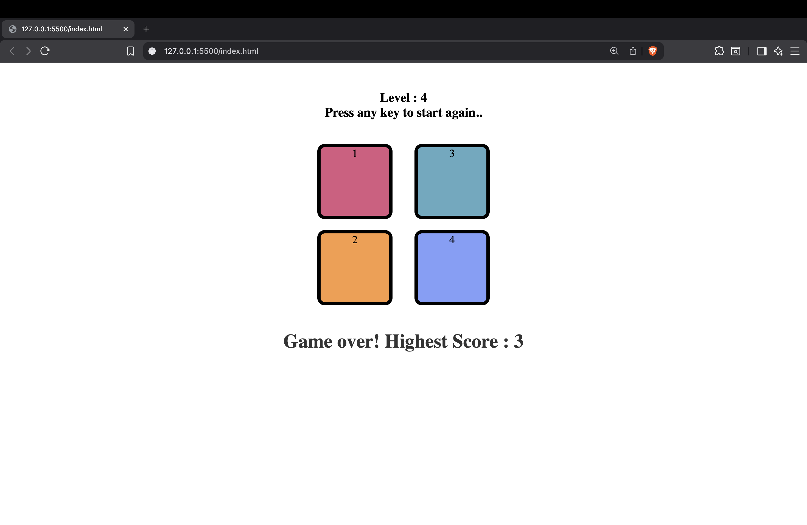

# Simon Says Game 🎮

A simple **Simon Says memory game** built using **HTML, CSS, and JavaScript**.
The game generates a sequence of colors and the player must repeat the sequence correctly to move to the next level.

---

## 📌 Features

* Random color sequence generation
* Increasing difficulty every level
* Visual button flash animations
* User click feedback
* High score tracking
* Game restart after losing

---

## 🛠️ Technologies Used

* HTML5
* CSS
* JavaScript (DOM Manipulation)

---

## 🎮 How to Play

1. Press **any key** to start the game.
2. The game will highlight a color button.
3. Remember the sequence of colors.
4. Click the buttons in the **same order** as the game.
5. Each new level adds **one more color** to the sequence.
6. If you click the wrong button, the game ends.

---

## 🧠 Game Logic

* The game stores the pattern using:

```
gameSequence[]
```

* The user's clicks are stored in:

```
userSequence[]
```

* Every level:

1. A random color is added.
2. The sequence is flashed.
3. The player must repeat it correctly.

If the user clicks the wrong color:

* Game Over message appears
* Highest score is displayed
* Game resets

---

## 🏆 High Score System

The game keeps track of the **highest level reached** during the session.

```
Game Over! Highest Score: X
```

---

## 📸 Screenshot



---
